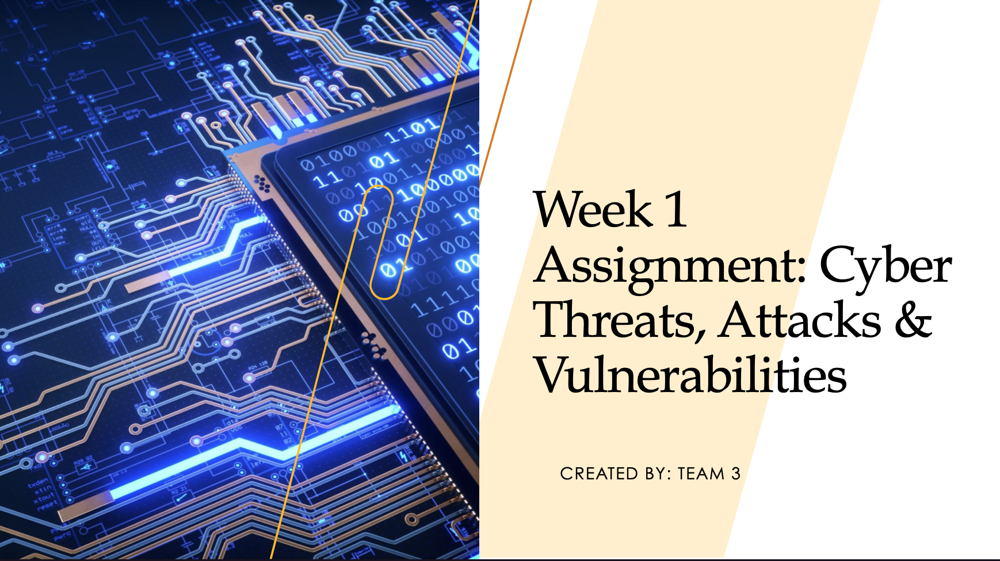

<h1>Understanding Cyber Threats and Mitigation Techniques</h1>

<h2>Description</h2>
This project consists of our week 1 team presentation to enhance our understanding of cyber threats, attacks, and vulnerabilities, and to analyze their impact on individuals, organizations, and society and propose effective strategies to mitigate them.
<br />


<h2>Powerpoint Presentation:</h2>

[Click Me: Powerpoint Presentation](https://imgur.com/a/yfDH8Of)

[](https://imgur.com/a/yfDH8Of)
<!--
 ```diff
- text in red
+ text in green
! text in orange
# text in gray
@@ text in purple (and bold)@@
```
--!>
